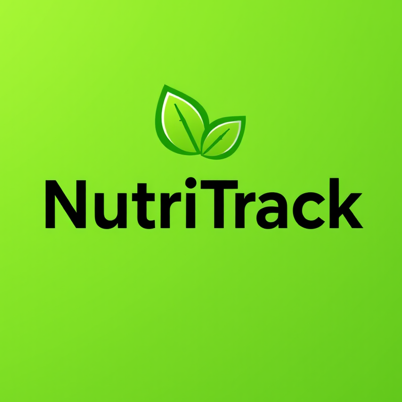

<div align="center">
  
</div>

# NutriTrack

NutriTrack is a comprehensive mobile application designed to help users manage their nutrition, track meals, monitor health indicators like BMI, and receive personalized meal recommendations.

## Features

- **User Authentication**

  - Registration with email and password
  - Secure login system

- **Profile Management**

  - Personal information management
  - BMI calculation and interpretation
  - Customizable daily calorie goals

- **Meal Management**

  - Record meals with detailed information
  - Track calorie intake
  - View and manage meal history
  - Edit or delete recorded meals

- **Statistics and Analytics**

  - Daily, weekly, monthly, and yearly calorie tracking
  - Average calorie consumption calculations

- **Additional Features**

  - Personalized meal recommendations based on BMI
  - Restaurant table reservation system
  - Built-in chat support system
  - File uploading capabilities

## Excluded Functionality

- Nearest dietitian location and appointment reservation features were not implemented.

## Installation

1. Download the APK file from the [GitHub releases section](https://github.com/Swaggie190/nutritrack/releases) or directly from [this link](https://github.com/yourusername/nutritrack/releases/download/v0.1.0beta/app-releases.apk).
2. Enable "Install from Unknown Sources" in your Android device settings.
3. Open the downloaded APK file.
4. Follow the installation prompts.

## System Requirements

- Android 6.0 or higher
- Minimum 2GB RAM
- 100MB free storage space
- Internet connection for full functionality

## Development Stack

- Flutter
- Firebase Authentication
- Local SQLite database for offline functionality
- OpenStreetMap API for restaurant locations

## Running the Development Environment

1. Clone the repository:

```bash
git clone https://github.com/Swaggie190/nutritrack.git
```

2. Install dependencies:

```bash
cd nutritrack
flutter pub get
```

3. Start the development server:

```bash
flutter run
```

## Testing

To run the test suite:

```bash
flutter test
```

## Contributing

1. Fork the repository.
2. Create your feature branch (`git checkout -b feature/AmazingFeature`).
3. Commit your changes (`git commit -m 'Add some AmazingFeature'`).
4. Push to the branch (`git push origin feature/AmazingFeature`).
5. Open a Pull Request.

## License

This project is licensed under the MIT License - see the LICENSE.md file for details.

## Contact

SIBAFO Wisdom - [wisdomsibafo45@gmail.com](mailto:wisdomsibafo45@gmail.com)  
Project Link: [https://github.com/Swaggie190/nutritrack](https://github.com/Swaggie190/nutritrack)

## Acknowledgments

- Dr. Azanzi Jiomekong for project guidance
- The Flutter community
- All contributors and testers
